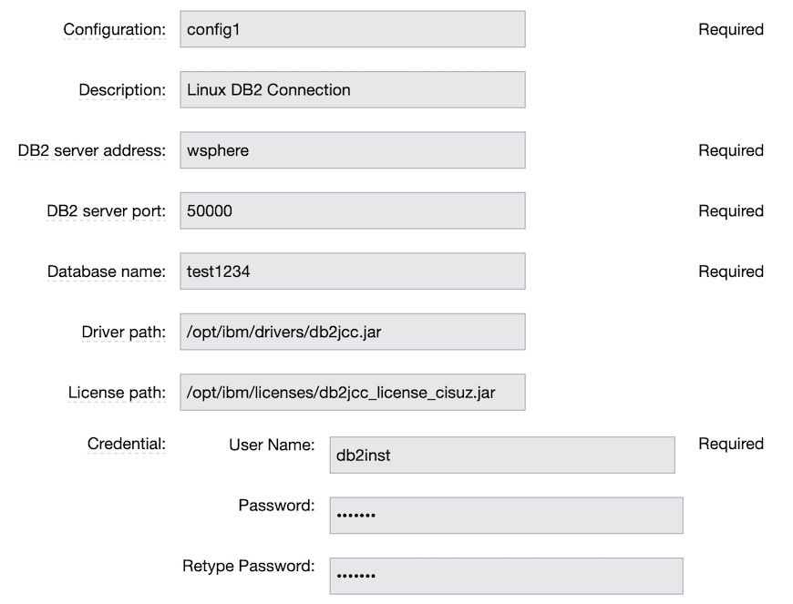
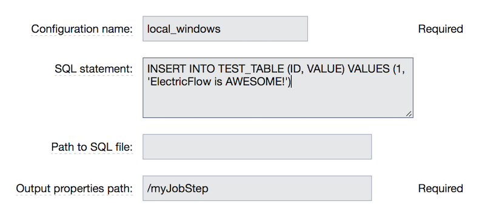
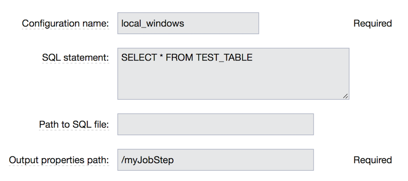

# IBM DB2 plugin

IBM DB2 is the database of choice for enterprise-wide solutions. Optimized to deliver industry-leading performance while lowering costs, IBM DB2 offers extreme performance, flexibility, scalability and reliability for any size organization.

The DB2 plugin for CloudBees CD/RO allows you to drive the deployment of DB2 database components as part of multi-tier web application releases. Using the integration, you can run any SQL commands to perform database deployment and management tasks such as creating, dropping or backing up tables, or updating schema and content.

# Integrated versions

This plugin was developed and tested against following IBM DB2 server:

-   IBM DB2 V11.1

List of supported platforms:

-   Linux

-   IBM AIX

-   IBM zOS

-   Windows

# Plugin prerequisites

-   The JDBC Driver jar for IBM DB2 should be copied to the ElectricFlow
    agent Machine.

-   In addition, if the database on which DB2 is installed is zOS the
    license jar required to connect to IBM DB2 should be copied to the
    ElectricFlow agent machine. Refer to IBM documentation for more
    details on using the right license.

This plugin was tested with `db2jcc\_license\_cisuz.jar`.

## Plugin configurations

Plugin configurations are sets of parameters that can be applied
across some, or all, of the plugin procedures. They
can reduce the repetition of common values, create
predefined parameter sets, and securely store credentials.
Each configuration is given a unique name that is entered
in the designated parameter for the plugin procedures that use them.

### Creating plugin configurations

To create plugin configurations in CloudBees CD/RO, complete the following steps:

1. Navigate to DevOps Essentials &gt; Plugin Management &gt; Plugin configurations.

2. Select *Add plugin configuration* to create a new configuration.

3. In the *New Configuration* window, specify a *Name* for the configuration.

4. Select the *Project* that the configuration belongs to.

5. Optionally, add a *Description* for the configuration.

6. Select the appropriate *Plugin* for the configuration.

7. Configure the parameters per the descriptions below.

You may need to create additional configurations later.

<table>
<colgroup>
<col style="width: 50%" />
<col style="width: 50%" />
</colgroup>
<thead>
<tr class="header">
<th style="text-align: left;">Parameter</th>
<th style="text-align: left;">Description</th>
</tr>
</thead>
<tbody>
<tr class="odd">
<td style="text-align: left;">
Configuration Name
</td>
<td style="text-align: left;">
Name of the plugin
configuration.
</td>
</tr>
<tr class="even">
<td style="text-align: left;">
Description
</td>
<td style="text-align: left;">
Description for the plugin
configuration.
</td>
</tr>
<tr class="odd">
<td style="text-align: left;">
DB2 server address
</td>
<td style="text-align: left;">
Address of DB2 server. Example:
db2-local
</td>
</tr>
<tr class="even">
<td style="text-align: left;">
DB2 server port
</td>
<td style="text-align: left;">
Port of DB2 server. By default
50000.
</td>
</tr>
<tr class="odd">
<td style="text-align: left;">
Database name
</td>
<td style="text-align: left;">
Name of DB2 database to
connect.
</td>
</tr>
<tr class="even">
<td style="text-align: left;">
Driver path
</td>
<td style="text-align: left;">
Absolute path to the DB2 jdbc driver
jar. For example /opt/ibm/drivers/db2jcc.jar
</td>
</tr>
<tr class="odd">
<td style="text-align: left;">
License path
</td>
<td style="text-align: left;">
Refer to the pre-requisites section to
determine if this license is required. Absolute path to the DB2 jdbc
license jar. For example
/opt/ibm/licenses/db2jcc_license_cisuz.jar
</td>
</tr>
<tr class="even">
<td style="text-align: left;">
Credential
</td>
<td style="text-align: left;"><ul>
<li>
<strong>User Name</strong>: Enter the name of the IBM DB2
user.
</li>
<li>
<strong>Password</strong>: Enter the password for the IBM DB2
user name.
</li>
<li>
<strong>Retype Password</strong>: Re-enter the password for the
IBM DB2 user name.
</li>
</ul></td>
</tr>
</tbody>
</table>

### Output

The DB2 Configurations page now shows the new configuration.

You can also manage your DB2 configurations in this page. Click **Edit**
to modify an existing configuration or **Delete** to remove an existing
configuration.

# Plugin procedures

## ExecuteSQL

This procedure executes SQL query against IBM DB2 server.

### Input

1.  In the Main Menu, click **Admin** &gt; **Plugins** to open the
    Plugin Manager.

2.  Got to the EC-DB2 plugin.

3.  Go to the ExecuteSQL procedure.

4.  Enter the following parameters:

<table>
<colgroup>
<col style="width: 50%" />
<col style="width: 50%" />
</colgroup>
<thead>
<tr class="header">
<th style="text-align: left;">Parameter</th>
<th style="text-align: left;">Description</th>
</tr>
</thead>
<tbody>
<tr class="odd">
<td style="text-align: left;">
Configuration name
</td>
<td style="text-align: left;">
Name of the configuration to be used.
URL and credentials are retrieved from the given configuration. A
Configuration defines connection details and can be created by going to
plugin configuration page.
</td>
</tr>
<tr class="even">
<td style="text-align: left;">
SQL statement
</td>
<td style="text-align: left;">
SQL query to execute.
</td>
</tr>
<tr class="odd">
<td style="text-align: left;">
Path to SQL file
</td>
<td style="text-align: left;">
Path to file that contains SQL
request.
</td>
</tr>
<tr class="even">
<td style="text-align: left;">
Output properties path
</td>
<td style="text-align: left;">
Path for result properties. If query is
select, all information will be stored as JSON array, otherwise affected
rows count will be stored as JSON object.
</td>
</tr>
</tbody>
</table>

### To do an insert

Output:

After the job runs, you can view the results on the Job Details page in
ElectricFlow. The status of the page was checked successfully.

In the **ExecuteSQL** step, select the *Log* button to see the diagnostic
information.

### To do a select

Output:

After the job runs, you can view the results on the Job Details page in
ElectricFlow. The status of the page was checked successfully.

In the **ExecuteSQL** step, select the *Log* button to see the diagnostic
information.

# Release notes

## EC-DB2 1.0.3

-   The documentation has been migrated to the main documentation site.

## EC-DB2 1.0.2

-   The plugin icon has been updated.

## EC-DB2 1.0.1

-   Fixed non-ascii characters in help.

## EC-DB2 1.0.0

-   Initial plugin release with following procedures:

    -   ExecuteSQL.

